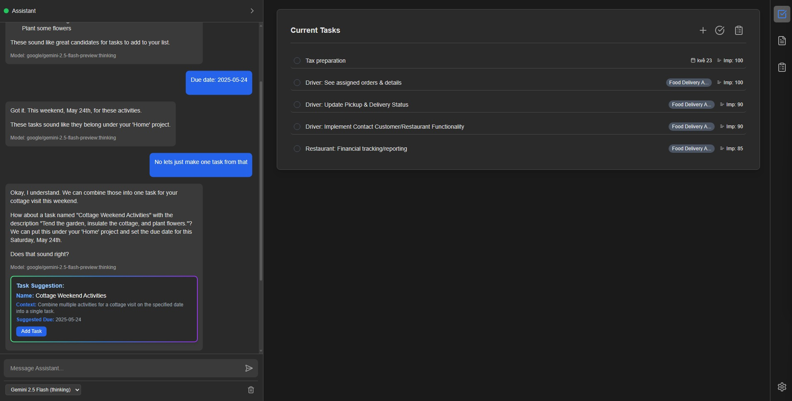
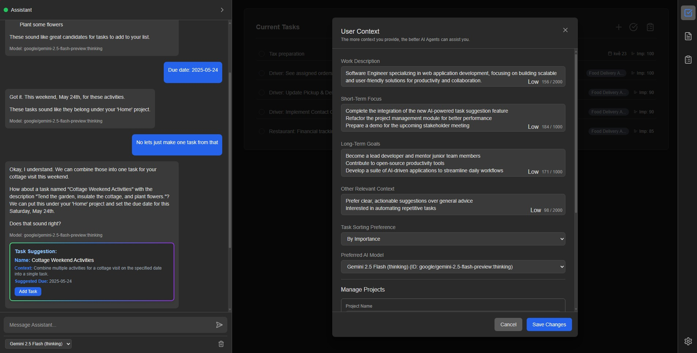
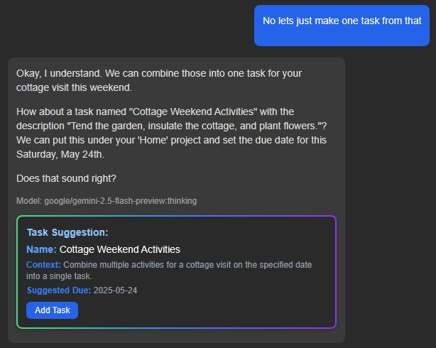
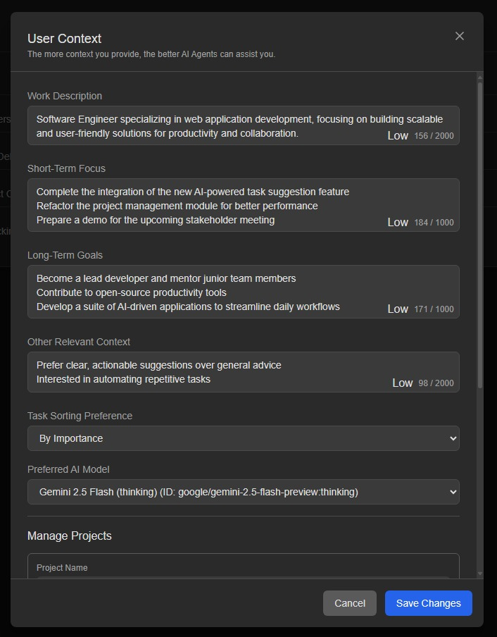

# ProductivAI

<p align="center">
  
</p>

ProductivAI is an intelligent productivity assistant built with Blazor that helps users manage tasks, projects, and goals through natural conversation and AI-powered suggestions.

## 🌟 Features

### Task Management

- Create, edit, and organize tasks with AI assistance
- Set importance levels and due dates
- Track task completion and progress
- Smart task suggestions based on context

### Project Planning

- Create and manage projects with color coding
- Break down projects into actionable tasks
- AI-assisted project planning and organization
- Track project progress and completion

### AI-Powered Assistance

- Natural language interaction for task and project management
- Smart task suggestions based on context
- Quick reply options for efficient communication
- Multiple AI model support (GPT-4, Gemini Pro, Mistral, etc.)

### Context-Aware

- Maintains user work context and goals
- Personalized task and project suggestions
- Adapts to user's short-term focus and long-term goals
- Smart sorting and prioritization

## 🏗️ Architecture Overview

ProductivAI is a modern, containerized web application with a clear separation of frontend and backend:

- **Frontend:** Blazor WebAssembly SPA for a rich, interactive user experience.
- **Backend:** ASP.NET Core Web API providing RESTful endpoints for all data operations.
- **Data Access:** Entity Framework Core (code-first) for ORM and migrations.
- **Database:** PostgreSQL, with automatic migrations applied on startup.
- **API Contracts:** Uses DTOs to decouple entity models from API responses.
- **Configuration:** Environment-based, supporting `.env` files and Docker secrets.
- **Deployment:** Fully containerized with Docker and Docker Compose for easy local and cloud deployment.

## 🛠️ Technology Stack

- **Frontend:** Blazor WebAssembly
- **Backend:** ASP.NET Core Web API
- **ORM:** Entity Framework Core (code-first migrations)
- **Database:** PostgreSQL
- **API:** RESTful endpoints (Projects, Tasks, Subtasks)
- **DTOs:** For clean API contracts
- **AI Integration:** OpenRouter API
- **State Management:** Blazor Services
- **UI Framework:** Custom CSS with modern design principles
- **Storage:** Browser Local Storage
- **Containerization:** Docker & Docker Compose
- **Configuration:** Environment variables, `.env` files, and `appsettings.json`
- **Supported AI Models:**
  - GPT-4
  - Gemini Pro
  - Mistral 7B
  - And more through OpenRouter

## 🚀 Getting Started

### Prerequisites
- Docker and Docker Compose
- Modern web browser
- OpenRouter API key
```bash
https://openrouter.ai/settings/keys
```

### Installation

1. Clone the repository
```bash
git clone https://github.com/KratosCube/ProductivAI.git
cd ProductivAI
```

2. Create a `.env` file in the root directory with your OpenRouter API key:
```bash
OPENROUTER_API_KEY="your_open_router_api"
```

3. Start the application using Docker Compose:
```bash
docker compose up -d
```

4. Access the application at `http://localhost:7069`

### Development Setup (Optional)

If you want to run the application locally for development:

1. Install .NET 8.0 SDK or later
2. Install dependencies:
```bash
dotnet restore
```
3. Run the application:
```bash
dotnet run
```

## 📱 Usage

### Task Management
1. View your tasks on the main dashboard
2. Add new tasks using the "+" button or through AI chat
3. Set importance levels and due dates
4. Mark tasks as complete when finished

### Project Planning
1. Create new projects from the project planning view
2. Add tasks to projects
3. Use AI assistance to break down projects into tasks
4. Track project progress

### AI Assistant
1. Open the chat panel
2. Describe what you want to accomplish
3. Get AI suggestions for tasks and projects
4. Use quick reply options for efficient interaction

## 🎯 Key Features in Detail

### Smart Task Suggestions

- AI analyzes your context and goals
- Suggests relevant tasks and projects
- Helps break down complex goals into actionable items

### Project Organization

- Color-coded projects for easy identification
- Hierarchical task organization
- Progress tracking and completion status

### Context Management

- Maintains work context and goals
- Adapts suggestions based on current focus
- Helps prioritize tasks effectively

## 🤝 Contributing

We welcome contributions! Please see our [Contributing Guidelines](CONTRIBUTING.md) for details.

## 📄 License

This project is licensed under the MIT License - see the [LICENSE](LICENSE) file for details.

## 🙏 Acknowledgments

- [OpenRouter](https://openrouter.ai/) for AI model access
- [Blazor](https://dotnet.microsoft.com/apps/aspnet/web-apps/blazor) for the web framework
- All contributors and users of ProductivAI

## 📞 Contact

For questions and support, please [open an issue](https://github.com/yourusername/ProductivAI/issues) or contact us at [your-email@example.com](mailto:your-email@example.com).

---

Made with ❤️ by [Your Name/Team] 